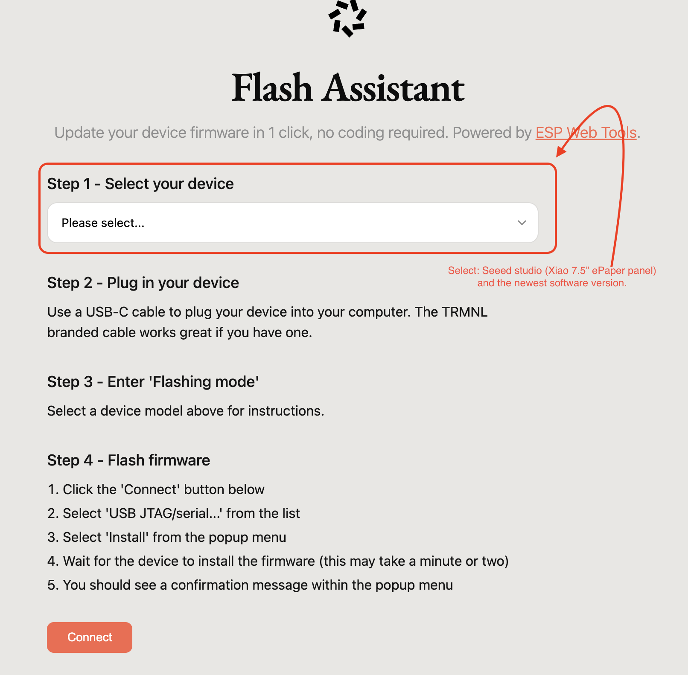
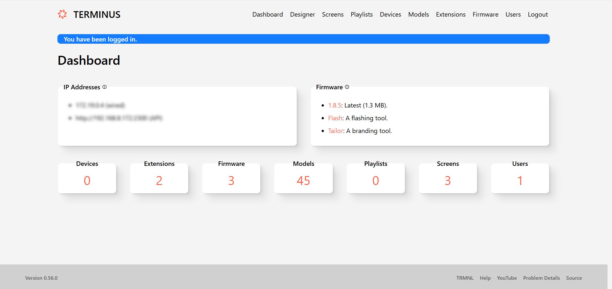

# Nordic TRMNL

A diy dashboard that is built with the TRMNL software in mind. Can display stuff like the your calendar, reminders or the public transit schedule. This repo is only for the hardware side. The TRMNL docs were a huge help in the design process and most of the electronics are based on their suggestions. This project was designed as a part of the HackClub hardware hackathon FALLOUT where people make hardware projects and get a chance to go to Shenzhen, China. More info available here [Fallout](https://fallout.hackclub.com)!

## Parts

- SEEED studio 7.5" monochrome e-ink display [SeeedStudio](https://www.seeedstudio.com/7-5-Monochrome-ePaper-Display-with-800x480-Pixels-p-5788.html)
- SEEED studio ePaper driver board [SeeedStudio](https://www.seeedstudio.com/ePaper-breakout-Board-for-XIAO-V2-p-6374.html)
- SEEED studio XIAO ESP32-C3 [SeeedStudio](https://www.seeedstudio.com/Seeed-XIAO-ESP32C3-p-5431.html)
- 3D printed [Case](./3Dfiles/)
- M2.5x5mm screws [Aliexpress](https://www.aliexpress.com/item/1005011821173994.html?spm=a2g0o.productlist.main.1.39d529a0qjtHul&algo_pvid=bd92e47b-3820-45da-b4b0-a0d232d1f28c&algo_exp_id=bd92e47b-3820-45da-b4b0-a0d232d1f28c-0&pdp_ext_f=%7B%22order%22%3A%22198%22%2C%22eval%22%3A%221%22%2C%22fromPage%22%3A%22search%22%7D&pdp_npi=6%40dis%21EUR%211.71%210.88%21%21%2113.24%216.79%21%402103846917755805715604071e08bf%2112000056711510764%21sea%21FI%210%21ABX%211%210%21n_tag%3A-29910%3Bd%3A2599385b%3Bm03_new_user%3A-29895%3BpisId%3A5000000197850338&curPageLogUid=PxbGNUoUDbsP&utparam-url=scene%3Asearch%7Cquery_from%3A%7Cx_object_id%3A1005011821173994%7C_p_origin_prod%3A)
- M2.5 Heated set inserts [Aliexpress](https://www.aliexpress.com/item/1005006838108683.html?spm=a2g0o.productlist.main.4.1a244CqV4CqVnV&aem_p4p_detail=2026040709481118270560359904760000294152&algo_pvid=09c63ec6-a5c4-490f-b016-4a70db189a22&algo_exp_id=09c63ec6-a5c4-490f-b016-4a70db189a22-3&pdp_ext_f=%7B%22order%22%3A%228643%22%2C%22eval%22%3A%221%22%2C%22fromPage%22%3A%22search%22%7D&pdp_npi=6%40dis%21EUR%213.95%210.88%21%21%2130.61%216.82%21%402103834817755804919052706ea73e%2112000038467725083%21sea%21FI%210%21ABX%211%210%21n_tag%3A-29910%3Bd%3A2599385b%3Bm03_new_user%3A-29895%3BpisId%3A5000000197850338&curPageLogUid=GGTl9fJBIg9O&utparam-url=scene%3Asearch%7Cquery_from%3A%7Cx_object_id%3A1005006838108683%7C_p_origin_prod%3A&search_p4p_id=2026040709481118270560359904760000294152_1)

## Build guide

If you are using the same components you can print the case available here [3D files](./3Dfiles). [Case folder](./3Dfiles/CaseOnly) has ready to print files that have the case parts. Use these if you are just printing the case. The case is designed to be printed in two parts which then are screwed together for the final build. The [full project folder](./3Dfiles/FullProject) has the whole Fusion project including the driver board PCB, ESP-32 and the display. You might want to use this if you want to edit the files. You might also want to adjust some tolerances if your printer has issues with these or you are using different inserts for example. My printer is a pretty budget FDM printer and it didn't have any issues. The two pieces most likely might not fit on the printer at the same time so you might need to print them seperately.

After getting the parts printed you can attach the ESP32 to the driver board using the pins and then connect the display to the driver board. The display should be installed in the display holder / first body part first. You should then install 4 heated inserts in each of the corners.

You can then take the second body part (the one with the pcb holder) and install the heated inserts for the driver board pcb (there are 4 holes). You can then screw in the pcb with the 2.5mmx5mm screws and attach the body parts together using the same screws remembering to route the display cable through the hole below the pcb holder.

Finally flash the software through a computer and plug in usb-c power. Then just walkthrough the device setup based on if you are using TRMNL servers or self-hosting.

You should check the software section for more detailed software instructions. As a TL;DR You can pretty much just use [this tool](https://trmnl.com/flash) to flash the firmware. You should still check the software section for detailed instructions.

If self-hosting follow the guide in the software section or the offical TRMNL guide available in the TRMNL dev [docs](https://docs.trmnl.com/go/diy/byod-s).

If you plan on using TRMNL servers. After flashing the firmware you have to buy access and then claim the device through the site. [Claim your device](https://trmnl.com/claim-a-device).

For mounting the device I used command strips / double sided tape. I think this is better than screws for example because the device is light enough to just be held up with double sided tape. Also making the device attach with screws reliably would be harder and in my opinion overkill.

If you don't have an outlet / power source next to you mounting point you can use a battery. The Seeed e-paper driver board comes with a JST connection to connect a battery and it seems to be pretty easy. I didn't need this since I have an outlet at the perfect spot to plug into and an extra usb-c power source laying around.

## Why does this exist ?

This was a personal project made to make my day to day life easier. Every morning when I wake up I first look at my school schedule then check the time and finally the weather. Of course because of early mornings I usually had to check atleast twice.

So I looked for solutions of displaying the weather while also being able to do other stuff like displaying a calendar or schedule. So I found the TRMNL which was close to a perfect solution for my problem. Unfortunately the official TRMNL OG was a bit too expensive and didn't come with a wall mount. So I decided to make my own. My goal for this project was to make something actually useful for me. For this it needed to do atleast 3 things.

1. Show me important information like the weather without having to look at my phone.
2. Wall mountable.
3. Not need to be charged or managed alot after creation.

## Software

For the software I will start off with explaining the installation process and then move onto some extra info about it.

### Installation

Start off with plugging in the ESP-32 to you computer. You can then open the tool [available here](https://trmnl.com/flash). You can pick the "Seeed studio (XIAO 7.5" ePaper panel)" because it uses the same controller the ESP32-C3.

To enter the ESP-32 into flashing mode you should plug it into your computer and hold down the BOOT button. This is the left button when looking at the board with the USB-c port pointing upwards. After this it should be visible in the USB JTAG/serial menu of your browser if you are using the web tool. After flashing the software to the ESP-32 you are down with the board and should move onto the configuring the server side. Incase you can't use the web tool for some reason you can find more detaikled instructions on [TRMNL's software GitHub page](https://github.com/usetrmnl/trmnl-firmware). This includes compaling the code yourself and having to combine .bin files and flashing them. This is mostly meant for developers and shouldn't be needed.

The next steps you need to do is setting up the server and syncing it to the display. If you plan on self-hosting (this means running a docker container with the TRMNL server on your own hardware like a RPI or a home server etc.). This option is a little bit more advanced compared to using TRMNL's servers and I would suggest that if you can afford it buying the licence is most likely worth it.

#### Buying access

For buying access you can navigate to [the TRMNL site store](https://shop.trmnl.com/products/byod). Here you can buy access / a license to use TRMNL servers for your display. The server is responsible for compiling all the data from different sources and then sending a page that the device can render to your display. This is the easier option and after flashing the firmware on your ESP-32 you should just be able to navigate to [The Claim your device page](https://trmnl.com/claim-a-device). Here you should input the data needed this includes account information and information about your BYOD license order. After claiming the device by connecting to the wifi hotspot of the TRMNL then using the login functionlaity to input your wifi information for the TRMNL to connect. Then the display should display a friendly id and you can input that to your dashboard and it should start working. You can start setting up what you want to see on your TRMNL.

I haven't setup my device this way yet and the setup flow can change so for the most up to date information you can check [the TRMNL site](https://docs.trmnl.com/go/diy/byod). Some of the setup flow was behind authentication and you need a licence for it so this guide might be missing a couple steps.

#### Self-Hosting

NOTE!

Self-hosting does require a lot more setup compared to buying access. Currently there are no ways of self-hosting that include the plugins made for the TRMNL hosted solution. Projects like Terminus are trying to make this better but they still aren't fully compatible and the plugin support is one of the major things still missing. I would suggest the hosted solution to everyone who isn't already experienced in home labbing and comfortable with self hosting services.

For self-hosting I will explain what I did in order to get it working. There are multiple OSS ways you can implement a self-hosted version of a TRMNL server. I used [Terminus](https://github.com/usetrmnl/terminus) which is the most popular way of doing this and is the closest to the hosted solution in terms of features. The Terminus project is still in beta and not 100% equal to just buying TRMNL access. They do have extensions and they are working on making the importing plugins possible from the hosted version. It still isn't fully inline with the TRMNL hosted solution.

For me since I already have a home server I chose this route to save some money and maybe learn a thing or two. There are already existing guides by on [the Terminus GitHub page](https://github.com/usetrmnl/terminus) and [in the TRMNL Help forum by Mario](https://help.trmnl.com/en/articles/12263392-connect-your-device-to-terminus-byos). Mario's guide covers how to sync your device to a server and the GitHub guide covers setting up the server itself. I have tried to summarise the main points here but these can help you if you want to know more about this etc.

So for starters you should have something to host this on. I used docker compose on my unraid server. I first installed the compose manager plus plugin from the unraid community app store. Then i just inputted the docker compose file available in [the terminus repo](https://github.com/usetrmnl/terminus/blob/main/compose.yml). A .env file should be created automatically. You can view the [Terminus github page configuration section](https://github.com/usetrmnl/terminus/blob/main/doc/configuration.adoc). It has great information on what the .env file includes and what each variable means.

Then I accessed the webui which was available at `http://HostedIp:2300`. Here I created a new user and password. Then I was able to access the web dashboard. It looks like this

Here you can navigate interface to browse different extensions. Some of them can be directly installed and some need some extra configuration. I have included a customized version of [the daily weather plugin / recipe](https://trmnl.com/recipes/150460) that I have modified to work on the self-hosted version. You can find it in the [software folder](./Software/software.md) (All credit goes to the original creator [Daniel Sitnik](https://github.com/danielsitnik/) and I just edited their code to work with the self-hosted version). You can use the devices section to see statistics from your device.

After flashing the software to the TRMNL itself. You can then connect it to power and see the screen of the TRMNL display you should connect to the wifi hotspot on your phone and use the sign in functionality on your phone to view the setup web portal (kind of like what you need to do on some public wifis to get online). You can navigate to the advanced software section and click custom server input the local address which should be `http://HostedIp:2300` to the api server input as well as your wifi credentials. If everything is good you should see a "Welcome to Terminus" screen.

Even though the self-hosted setup will work I might still move onto the hosted solution just for the plugins / recipes. The extensions in Terminus do get close but still aren't perfect and need some work to get working. I hope they can get the one click importing and exporting working soon. So as a suggestion if you have the money I would buy access to the TRMNL hosted servers just for the ease of use and the ecosystem around the hosted environment. Still I have attached my current main screen on my TRMNL incase you do end up self-hosting and want to see what I modified to make a normal recipe/plugin work.

## More info

I will be using the opensource TRMNL software and will be self-hosting the server. If you are replicating my design but can't self-host there is a one time purchase of 43,95€ to use TRMNL servers. TRMNL software Github [Repo](https://github.com/usetrmnl/trmnl-firmware) and TRMNL website [Trmnl.com](https://trmnl.com/). TRMNl has a large [plugin environment](https://trmnl.com/integrations) and a user made [Recipes](https://trmnl.com/recipes). These plugins are the life blood of the device in my opinion and makes it possible to customize what is displayed according to what you need. For example if you are interested Formula 1 you can use the Formula 1 plugin to follow the races. For self-hosting on terminus these are replaced by extensions which try to do most of the things plugins can.

## Why it's a bit better ?

So the my diy Nordic TRMNL is made to be wall mountable. This makes it easier to blend in to the environment. Also buying the components directly and self hosting the server makes the whole package a little bit cheaper. I am still thankful that TRMNL decided to open source the software and make the product diyable and self-hostable. So there are somethings that I think my TRMNL is better for.

## Wiring

I made a wiring diagram of the connections in KiCad. Most of the connections are just plug and play and using the sockets that are on the driver board the connections are pretty simple. Still there is a wiring diagram if it's needed. Also available as a [kicad schematic](./WiringDiagram/NordicTrmnl.kicad_sch).

Here is another wiring diagram with pictures that shows how they attach together IRL. This might be easier to read.

## Zine Page

## Excalidraw / Notes

I used excalidraw during my design process. The mind map screenshot attached has most of my design notes. The mind map is available as an [excalidraw file](./Excalidraw/Notes.excalidraw) for a better viewing experience.,
.

Bill of Materials available here: [BOM](./BOM.csv)

## Pictures

Here are some more pictures of the project.

Case from behind with screen and PCB.

Case from the front without screen and PCB.

Simple Excalidraw Wiring diagram. I made this before the "real one" in Kicad.

## Acknowledgements

Thanks to Hack Club and the Fallout event for making this project possible.
Thanks to TRMNL for open sourcing their software and making custom devices and self hosting possible.
Thanks to Terminus for their self-hosted server software.
