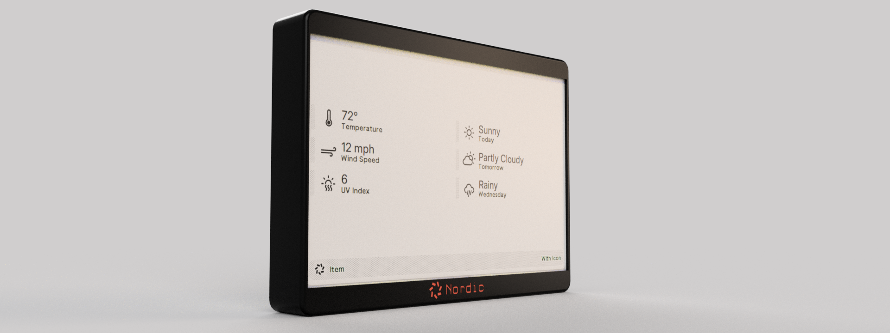
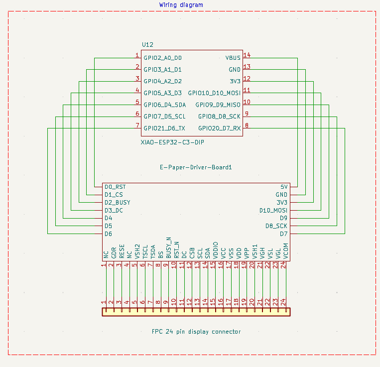
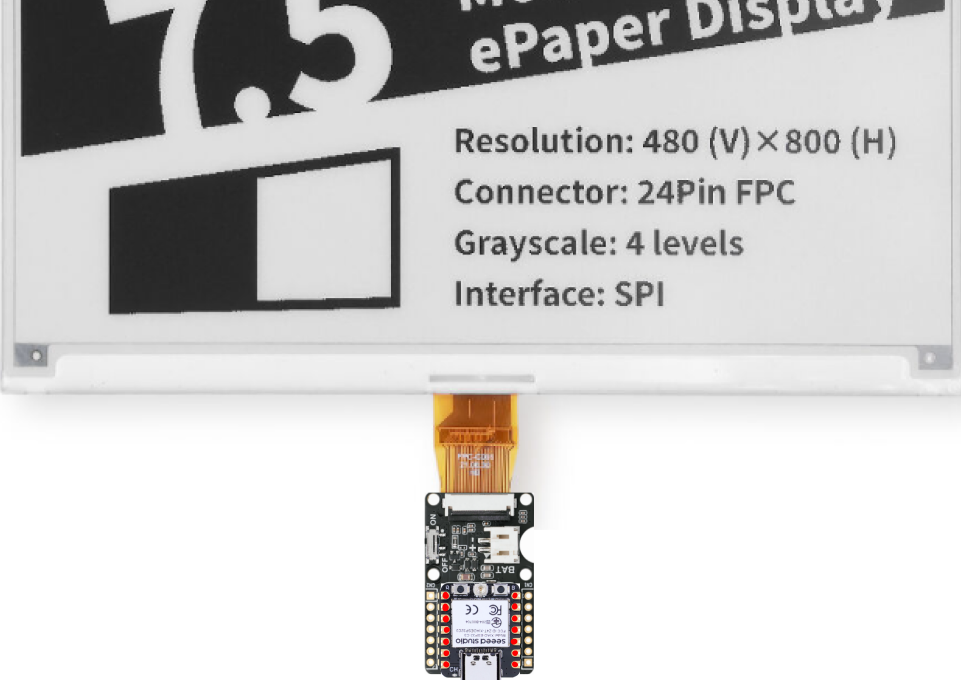
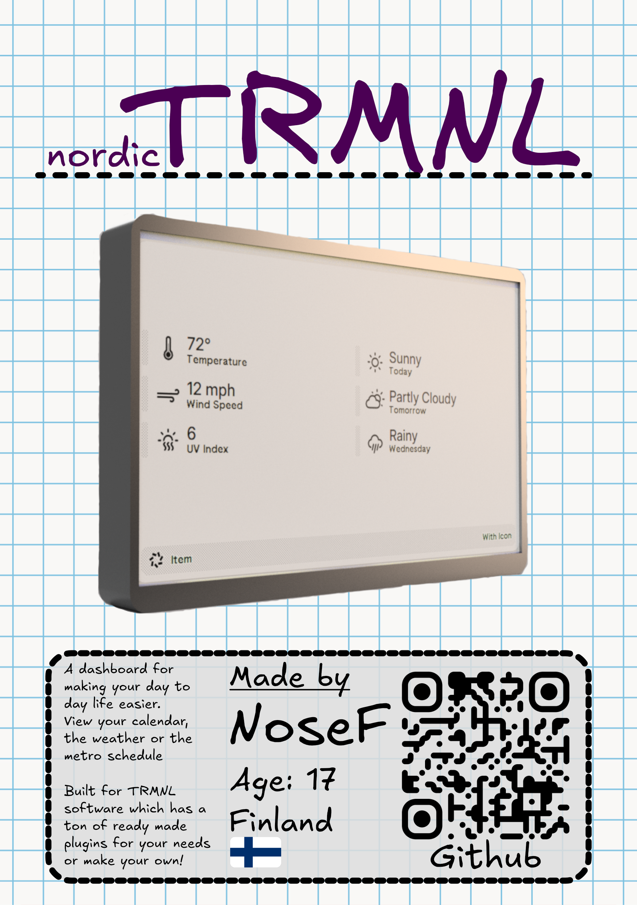
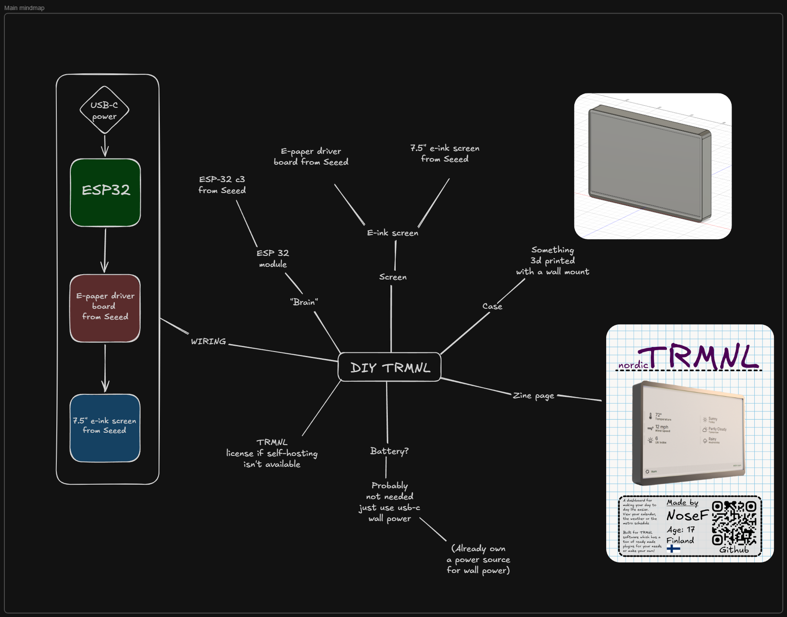
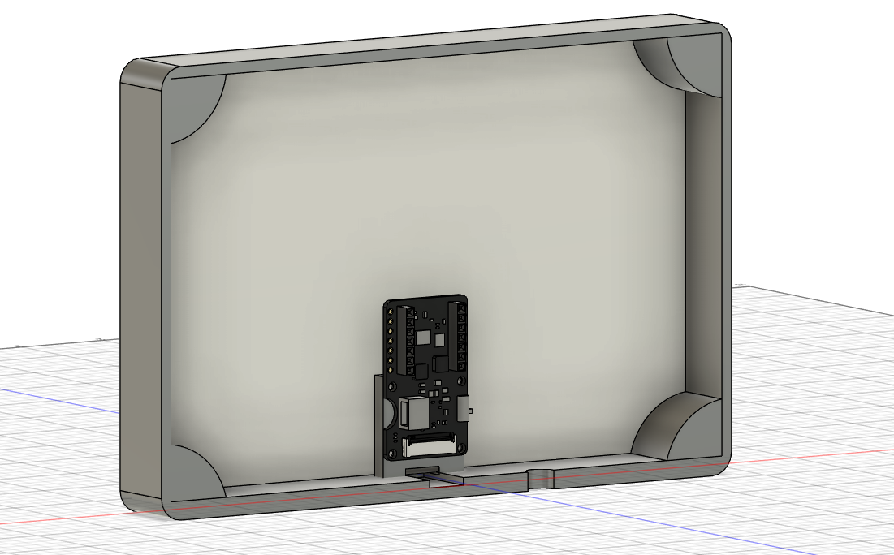
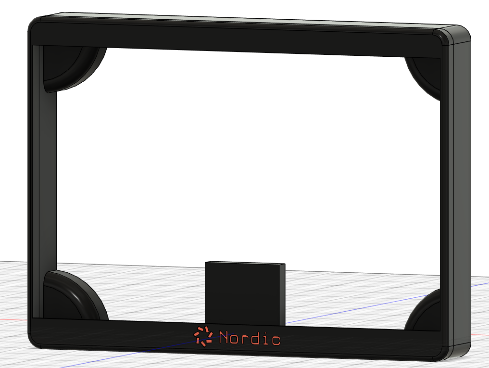
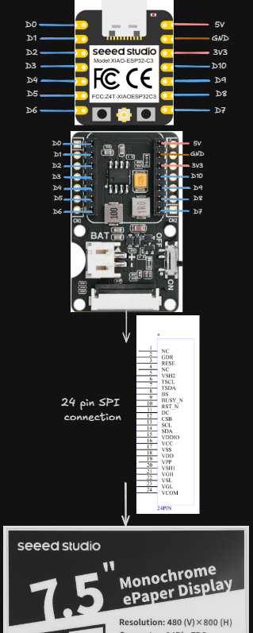

# Nordic TRMNL

A diy dashboard that is built with the TRMNL software in mind. Can display stuff like the your calendar, reminders or the public transit schedule. This repo is only for the hardware side. The TRMNL docs were a huge help in the design process and most of the electronics are based on their suggestions. This project was designed as a part of the HackClub hardware hackathon FALLOUT where people make hardware projects and get a chance to go to Shenzhen, China. More info available here [Fallout](https://fallout.hackclub.com)!

## Parts

- SEEED studio 7.5" monochrome e-ink display [SeeedStudio](https://www.seeedstudio.com/7-5-Monochrome-ePaper-Display-with-800x480-Pixels-p-5788.html)
- SEEED studio ePaper driver board [SeeedStudio](https://www.seeedstudio.com/ePaper-breakout-Board-for-XIAO-V2-p-6374.html)
- SEEED studio XIAO ESP32-C3 [SeeedStudio](https://www.seeedstudio.com/Seeed-XIAO-ESP32C3-p-5431.html)
- 3D printed [Case](./3Dfiles/)
- M2.5x5mm screws [Aliexpress](https://www.aliexpress.com/item/1005011821173994.html?spm=a2g0o.productlist.main.1.39d529a0qjtHul&algo_pvid=bd92e47b-3820-45da-b4b0-a0d232d1f28c&algo_exp_id=bd92e47b-3820-45da-b4b0-a0d232d1f28c-0&pdp_ext_f=%7B%22order%22%3A%22198%22%2C%22eval%22%3A%221%22%2C%22fromPage%22%3A%22search%22%7D&pdp_npi=6%40dis%21EUR%211.71%210.88%21%21%2113.24%216.79%21%402103846917755805715604071e08bf%2112000056711510764%21sea%21FI%210%21ABX%211%210%21n_tag%3A-29910%3Bd%3A2599385b%3Bm03_new_user%3A-29895%3BpisId%3A5000000197850338&curPageLogUid=PxbGNUoUDbsP&utparam-url=scene%3Asearch%7Cquery_from%3A%7Cx_object_id%3A1005011821173994%7C_p_origin_prod%3A)
- M2.5 Heated set inserts [Aliexpress](https://www.aliexpress.com/item/1005006838108683.html?spm=a2g0o.productlist.main.4.1a244CqV4CqVnV&aem_p4p_detail=2026040709481118270560359904760000294152&algo_pvid=09c63ec6-a5c4-490f-b016-4a70db189a22&algo_exp_id=09c63ec6-a5c4-490f-b016-4a70db189a22-3&pdp_ext_f=%7B%22order%22%3A%228643%22%2C%22eval%22%3A%221%22%2C%22fromPage%22%3A%22search%22%7D&pdp_npi=6%40dis%21EUR%213.95%210.88%21%21%2130.61%216.82%21%402103834817755804919052706ea73e%2112000038467725083%21sea%21FI%210%21ABX%211%210%21n_tag%3A-29910%3Bd%3A2599385b%3Bm03_new_user%3A-29895%3BpisId%3A5000000197850338&curPageLogUid=GGTl9fJBIg9O&utparam-url=scene%3Asearch%7Cquery_from%3A%7Cx_object_id%3A1005006838108683%7C_p_origin_prod%3A&search_p4p_id=2026040709481118270560359904760000294152_1)

## Software

I will be using the opensource TRMNL software and will be self-hosting the server. If you are replicating my design but can't self-host there is a one time purchase of 43,95€ to use TRMNL servers. TRMNL software Github [Repo](https://github.com/usetrmnl/trmnl-firmware) and TRMNL website [Trmnl.com](https://trmnl.com/). TRMNl has a large [plugin environment](https://trmnl.com/integrations) and a user made [Recipes](https://trmnl.com/recipes). These plugins are the life blood of the device in my opinion and makes it possible to customize what is displayed according to what you need. For example if you are interested Formula 1 you can use the Formula 1 plugin to follow the races.

## Build guide

If you are using the same components you can print the case available here [3D files](./3Dfiles). [Case folder](./3Dfiles/CaseOnly) has ready to print files that have the case parts. Use these if you are just printing the case. You will have to print the case and pcb holder seperately. The [full project folder](./3Dfiles/FullProject) has the whole Fusion project including the driver board PCB and the display. You might want to use this if you want to edit the files.

Attach the ESP32 to the driver board using the pins and then connect the display to the driver board. The display should be installed in the case first and the cable routed through the hole made for it. The PCB holder has holes for you to press in heated inserts and then you can screw in 2.5mm screws in to attach the board to holder and then to the case. Finally flash the software through a computer and plug in usb-c power. Then just walkthrough the device setup based on if you are using TRMNL servers or self-hosting.

For flashing the device you can use this [tool](https://trmnl.com/flash) made by TRMNL. You can pick the "Seeed studio (XIAO 7.5" ePaper panel)" because it uses the same ESP32-C3. Just open the tool, plug in the ESP32, enter flash mode and press flash.

If self-hosting follow the up to date guide available in the TRMNL dev [docs](https://docs.trmnl.com/go/diy/byod-s). This is the guide I used for my setup.

If you plan on using TRMNL servers. After flashing the firmware you have to buy access and then claim the device through the site. [Claim your device](https://trmnl.com/claim-a-device). Then you can follow the instructions given on the TRMNL dev [docs](https://docs.trmnl.com/go/diy/byod).

For mounting I used command strips / double sided tape. I think this is better than screws for example because the device is light enough to just be held up with double sided tape. Also making the device attach with screws reliably would be harder and in my opinion overkill.

If you don't have an outlet / power source next to you mounting point you can use a battery. The Seeed e-paper driver board comes with a JST connection to connect a battery and it seems to be pretty easy. I didn't need this since I have an outlet at the perfect spot to plug into and an extra usb-c power source laying around.

## Why does this exist ?

This was a personal project made to make my day to day life easier. Every morning when I wake up I first look at my school schedule then check the time and finally the public transit schedule. Of course because of early mornings I usually had to check atleast twice.

So I looked for solutions of displaying a calendar. I needed it to be digital because I didn't have energy to use a paper calendar. So I found the TRMNL which was close to a perfect solution for my problem. Unfortunately the official TRMNL OG was a bit too expensive and didn't come with a wall mount. So I decided to make my own. My goal for this project was to make something actually useful for me. For this it needed to do atleast 3 things.

1. Show me my calendar and schedule without having to look at my phone.
2. Wall mountable.
3. Not need to be charged or managed alot after creation.

## Why it's a bit better ?

So the my diy Nordic TRMNL is made to be wall mountable. This makes it easier to blend in to the environment. Also buying the components directly and self hosting the server makes the whole package a little bit cheaper. I still am thankful that TRMNL decided to open source the software and make the product diyable and self hostable. So there are somethings that I think my TRMNL is better for.

## Wiring

I made a wiring diagram of the connections in KiCad. Most of the connections are just plug and play and using the sockets that are on the driver board the connections are pretty simple. Still there is a wiring diagram if it's needed. Also available as a [kicad schematic](./WiringDiagram/NordicTrmnl.kicad_sch).

Here is another wiring diagram with pictures that shows how they attach together IRL. This might be easier to read.

## Zine Page

## Excalidraw / Notes

I used excalidraw during my design process. The mind map screenshot attached has most of my design notes. The mind map is available as an [excalidraw file](./Excalidraw/Notes.excalidraw) for a better viewing experience.,
.

Bill of Materials available here: [BOM](./BOM.csv)

## Pictures

Here are some more pictures of the project.

Case from behind with screen and PCB.

Case from the front without screen and PCB.

Simple Excalidraw Wiring diagram. I made this before the "real one" in Kicad.
