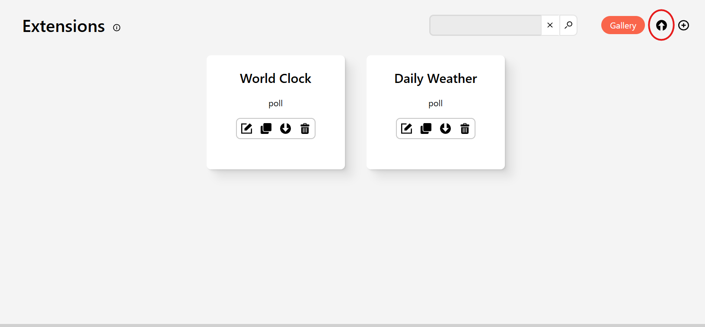

# Weather extension

This extension was made by [Daniel Sitnik](https://github.com/danielsitnik/). I modified some of the names of the variables just to match the syntax for terminus. You will probably need to modify the URL provided by the template. You will need to set your prefered temperature units and location using longitude and latitude. When you install the extension these will be set to the once I used so you will want to modify them. You can install this extension just by navigating to the extension section and clicking the import extension button (highlighted in the screenshot).

Then you can simply pick the [.zip file](extension-daily_weather.zip) and it should install automatically. ONCE AGAIN THIS EXTENSION IS NOT MADE BY ME AND JUST EDITED TO WORK WITH TERMINUS!!!

After this you can add the screen to a playlist and it should be come visible on your TRMNL.

## What I changed ?

To get the extension to work I had to add the `source_1.` prefix to variables that used the open meteo api and I had to remove the `source_1.` prefix from places it already existed but that didn't actually use it as a source. So I removed it from the sources for the pictures. This same basic concept can be used to convert almost any of the extensions. 
I didn't end up making a calendar extension since the ones that existed didn't work on Terminus yet at all or I didn't have the technical skills to make them work with my calendar setup. Terminus also didn't seem to accept `.ical` files as sources. This might have been just a problem with my skill (I'm not super good at coding and software stuff) but it seemed like too large a hassle for now. Terminus is being updated so maybe soon importing will be just onclick.

You can view the raw software files in the [Unzipped software folder](./UnzippedSoftware/). The changes I made are to the [Template.html.liquid](./UnzippedSoftware/template.html.liquid) the [configuration.yml](./UnzippedSoftware/configuration.yml) hasn't been edited. ONCE AGAIN THIS EXTENSION IS NOT MADE BY ME AND I JUST EDITED THE TEMPLATE FILE TO WORK WITH TERMINUS!!!